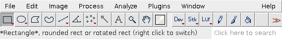
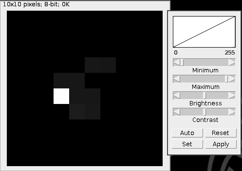
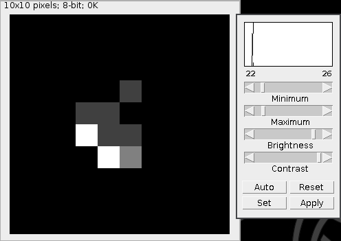

# FIJI Starter Guide

Authors: Alice Williart (ENS/Institut Curie)
Nicolas CARPi (Institut Curie)

## Introduction

When it comes to image analysis, several software can do the job. But the one you should focus on and learn its capabilities is probably [ImageJ](https://imagej.nih.gov/ij/index.html). It's free, open source and you can install it anywhere. It is the swiss knife of image analysis and a must have tool for anyone working with scientific images. Developing your skills with this software is a good investement in the future, as you'll always be able to use it. Unlike a proprietary expensive software that will not always be available to you.

Fiji is Just ImageJ, but with already a bunch of plugins installed. This is what you want to install. It also features a plugin manager so you can extend it easily and keep the plugins up-to-date.

Here are the very basics on how to use some functionalities. This is a getting started guide.

## Installation

Fiji can be downloaded from [this page](http://fiji.sc/#download). It is available on all platforms and is written in Java.

## First run

Start Fiji. You'll get a window like this one:

### Configure memory

Working with images (especially now with the latest camera chips producing big images) means you'll use a lot of RAM. So we need to tell Fiji how much RAM it can use. Go in Edit > Options > Memory & Threads and set the "Maximum memory" to X = Y - 2Gb where Y is the total amount of RAM you have. Don't set it to the maximum of RAM you have, or you won't have any left for the rest of the operating system! Tick the "Keep multiple undo buffers" box too.

## Understanding images

An image from one channel is treated as a matrix of pixels, __i.e.__ a table of values assigned to each position. Common image types obtained after microscopy are 16-bits images, __i.e.__ with pixel values ranging from 0 to 2^{16}-1=65535. Other types include 8-bits (pixel values between 0 and 2^8-1=255) and 32-bits (pixel values between 0 and 2^{32}-1), as well as RGB, which associates 3 values to each pixel (one for red, one for green and one for blue). 16-bits is the most used for quantifications while 8-bits or RGB are used for visualisation.

Any function indicated below can be found by the search bar. It'll always be faster to type the function you want in the search bar than to look for it in the menus.

## Files format and import

Fiji supports most files format thanks to the Bioformat plug-in. The most used format is probably [TIFF](https://en.wikipedia.org/wiki/TIFF).

To open one file, you can simply use "Open" in the "File" menu or drag the file onto the Fiji toolbar. For multiple files opening, __e.g.__ timepoints, channels, **"Open:Image sequence"** is very useful. It allows to open files in the folder with a defined frequency (__i.e.__ every other image), files whose name contains a particular character string (__e.g.__ "GFP", "t0"), etc.

Keep in mind that by default, Fiji opens the files in RAM. If you open a too big image, you might run out of memory and the process will crash. You can tick **"Open:Use virtual stack"** to workaround this limitation. With this option, Fiji only loads in memory the one image you're looking at, not the full stack. You can use the "Monitor Memory" window to have an idea of the amount of memory used. Clicking the bar under the icons will run the garbage collector and free up some memory.

## Image display and treatment

When you open a file, one of the first things you might want to do is to adjust the way it is displayed. It's important to understand that the display is different from the image itself. Modifying the display (brightness and contrast) doesn't change the value of the pixels in the image. It just tells Fiji to use X as black and Y as white so you can actually see your signal.

Example:

You have an 8 bit image with a signal in the range of 20-25. You'll see the features better if you set black to 20 and white to 30 (instead of 0 and 255).

Before setting B&C:

After setting it, the features appear to the human eye:

### Brightness and Contrast

Shortcut : __shift+C__

Note about shortcuts: you don't need to type "Ctrl" (or "Cmd" on MacOS). Typing directly the letter works fine.

The B&C window shows the numbers of pixel at each height in a histogram, coupled to a curve giving the relationship between the displayed and the real intensity of a pixel (by default linear). By default, the maximal display intensity corresponds to the highest possible pixel value (__e.g.__ 255 in 8-bit) and the minimal one is 0. However, if the signal of interest is less spread, you might want to rescale it using the __"min"__ and __"max"__ scales.

Note that changes in the B&C window do not alter the values of the pixels. It simply changes the display.

### Image properties

You can access your image's properties in **Image:Properties**. This will give you (or allow you to change) the pixel/voxel dimension and the timelapse between timepoints. These are stored in with the image in .tif (Tagged Image File). You can tick __Global__ to apply these properties to all subsequent images.

### Lookup Table (LUT)

Since an image in 8-bits or 16-bits is merely a matrix of numbers, it is up to the user to decide how to visualise it. The default view is a grey scale. However, you might want to display a green scale (__e.g.__ if the image corresponds to the GFP channel) or other scales (__e.g.__ blue for low values and red for high values). This can be changed in **"Image:Lookup table**. Note : these are virtual colours: they do not affect your image, only the way it is displayed.

## Quantitative analysis

Before doing anything with your image, it is recommended to duplicate it (__shift+D__). Fiji doesn't have a "cancel last" function (the "Undo" rarely works as expected). You should work on the 16-bit images.

### Apply a mask

If you want to look at certain objects only, whose pixel value is above a given threshold, you can use **"Image:Threshold"** (shortcut : __shift+T__). After adjusting your threshold of choice on the histogram, you obtain a binary image defined as below or above threshold. This can be then used as a mask to analyse the original image (which is why you are happy to have duplicated it !). To obtain quantitative information about the objects of interest, you can use **"Analyze:Set measurements** to choose which parameters you want and set __Redirect to__ your image of interest to apply the mask. Then go to **"Analyze:Analyze particles** and you will obtain a table with the desired results.

## Processing multiple images

If you are doing timelapse or multiple channels, you will have several images you might want to process together. You can put them together in a stack (3D) or hyperstack (4D or 5D or more). In order to do this, you can use **"Image:Stack:Images to stack**. You can then make montages, Z projection (**"Image:Stack:Z project** or **"Image:Stack:3D project**) if one of the dimension is the depth, make a movie if you have timelapses.

## Writing macros

Macros are a way to avoid repeating the same steps on multiple images. Writing macros is outside of the scope of this document, but you should know that you can record the actions you make with the Plugins > Macros > Record… menu item. And with the help of the [ImageJ Macro Language](https://imagej.nih.gov/ij/developer/macro/macros.html) you can write a little program (macro) that process all the files in a directory with the steps you want.

Here is a some code to get you started; this program opens an image sequence (all files with "GFP" in the filename) and saves a stack:

~~~js
// don't display the images because we are in a program
// set this at the top of all your scripts
setBatchMode(true);

// ask user for folder to analyze
dir=getArgument();

// open the images as stack (only files with GFP in the filename)
run("Image Sequence...", "open="+dir+" number=0 starting=1 increment=1 scale=100 file=[GFP] or=[] sort");

// save the stack
saveAs("Tiff", dir+"stack.GFP.tif");

// close the opened image
close();
~~~

Use the recorder to figure out what are the functions to call with which arguments.

Have fun!
